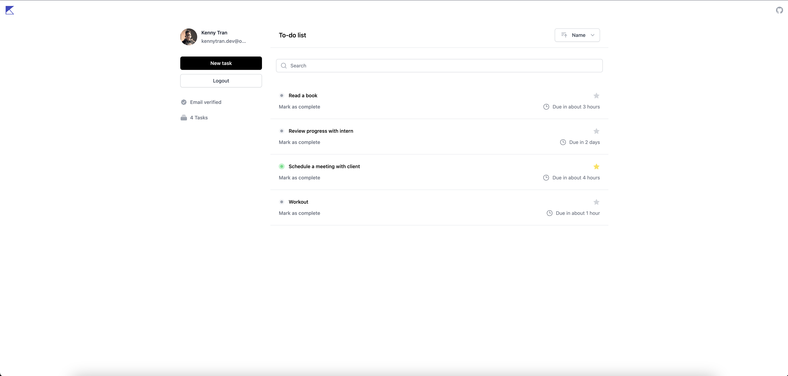

## Run Locally

```bash
pnpm install
pnpm dev
```

## About
This is my to-do app built on Firebase and Jotai. Feel free to contribute and use it for inspiration.

## Features
- Firebase auth
- State management with Jotai primitives
- Firestore CRUD
- date formatting (date-fns)
- Sort tasks by name & date
- Search filter

## Stack
- Next.js
- Typescript
- Tailwind CSS
- Firebase
- Jotai
- Framer-motion

## License

This project is open source and available under the [MIT License](LICENSE.md).
